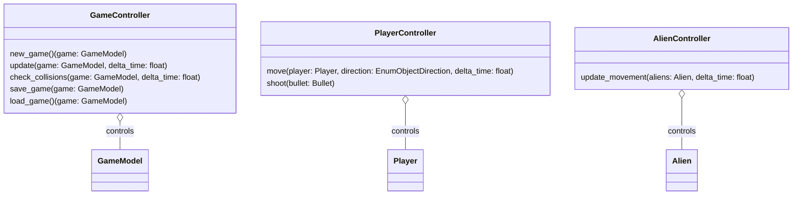

```mermaid
classDiagram
    class GameController {
        new_game()(game: GameModel)
        update(game: GameModel, delta_time: float)
        check_collisions(game: GameModel, delta_time: float)
        save_game(game: GameModel)
        load_game()(game: GameModel)
    }

    class PlayerController {
        move(player: Player, direction: EnumObjectDirection, delta_time: float)
        shoot(bullet: Bullet)
    }

    class AlienController {
        update_movement(aliens: Alien, delta_time: float)
    }


    GameController o-- GameModel : controls
    PlayerController o-- Player : controls
    AlienController o-- Alien : controls
  
```