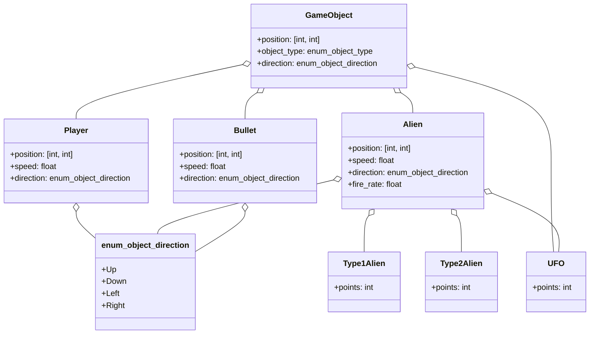

```mermaid
classDiagram
    class GameObject {
        +position: [int, int]
        +object_type: enum_object_type
        +direction: enum_object_direction
    }

    class Player {
        +position: [int, int]
        +speed: float
        +direction: enum_object_direction
    }

    class Alien {
        +position: [int, int]
        +speed: float
        +direction: enum_object_direction
        +fire_rate: float
    }

    class Type1Alien {
        +points: int
    }
    class Type2Alien {
        +points: int

    }

    class UFO {
    	+points: int
    }

    class Bullet {
        +position: [int, int]
        +speed: float
        +direction: enum_object_direction
    }

    class enum_object_direction {
        +Up
        +Down
        +Left
        +Right
    }

    GameObject o-- Player 
    GameObject o-- Alien 
    GameObject o-- Bullet 
    GameObject o-- UFO 
    
    Alien o-- Type1Alien
    Alien o-- Type2Alien
    Alien o-- UFO
    

    Player o-- enum_object_direction 
    Alien o-- enum_object_direction 
    Bullet o-- enum_object_direction 
```