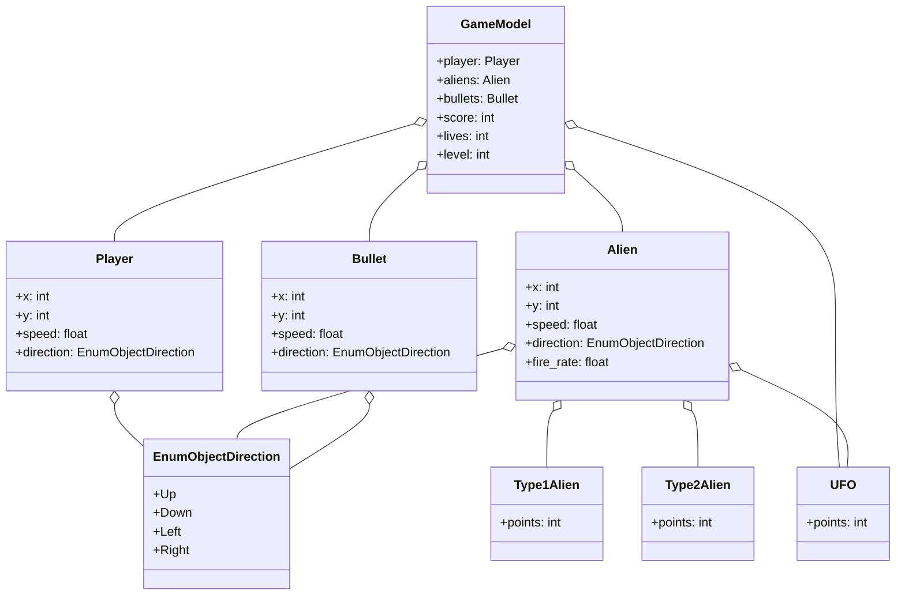

```mermaid
classDiagram
    class GameModel {
        +player: Player
        +aliens: Alien
        +bullets: Bullet
        +score: int
        +lives: int
        +level: int
    }

    class Player {
        +x: int
        +y: int
        +speed: float
        +direction: EnumObjectDirection
    }

    class Alien {
        +x: int
        +y: int
        +speed: float
        +direction: EnumObjectDirection
        +fire_rate: float
    }

    class Type1Alien {
        +points: int
    }
    class Type2Alien {
        +points: int

    }

    class UFO {
    	+points: int
    }

    class Bullet {
        +x: int
        +y: int
        +speed: float
        +direction: EnumObjectDirection
    }

    class EnumObjectDirection {
        +Up
        +Down
        +Left
        +Right
    }

    GameModel o-- Player 
    GameModel o-- Alien 
    GameModel o-- Bullet 
    GameModel o-- UFO 
    
    Alien o-- Type1Alien
    Alien o-- Type2Alien
    Alien o-- UFO
    

    Player o-- EnumObjectDirection 
    Alien o-- EnumObjectDirection 
    Bullet o-- EnumObjectDirection 
```