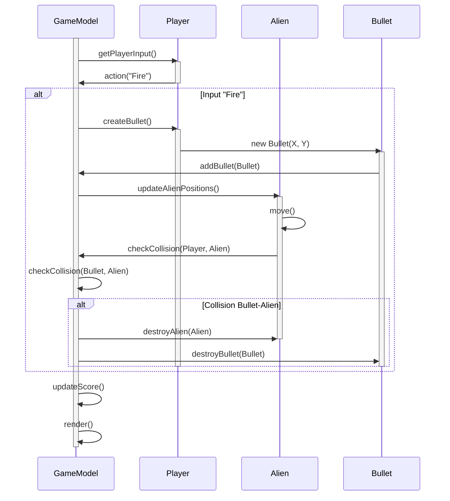

```mermaid
sequenceDiagram
    participant G as GameModel
    participant P as Player
    participant A as Alien
    participant B as Bullet

    activate G
    G->>P: getPlayerInput()
    activate P
    P->>G: action("Fire")
    deactivate P

    alt Input "Fire" 
        G->>P: createBullet()
        activate P
        P->>B: new Bullet(X, Y)
        activate B
        B->>G: addBullet(Bullet)

        G->>A: updateAlienPositions()
        activate A
        A->>A: move()
        A->>G: checkCollision(Player, Alien)
        G->>G: checkCollision(Bullet, Alien)

        alt Collision Bullet-Alien
            G->>A: destroyAlien(Alien)
            deactivate A
            G->>B: destroyBullet(Bullet)
        end
         deactivate B
        deactivate P
    end


    G->>G: updateScore()
    
    
    G->>G: render()
    deactivate G
```