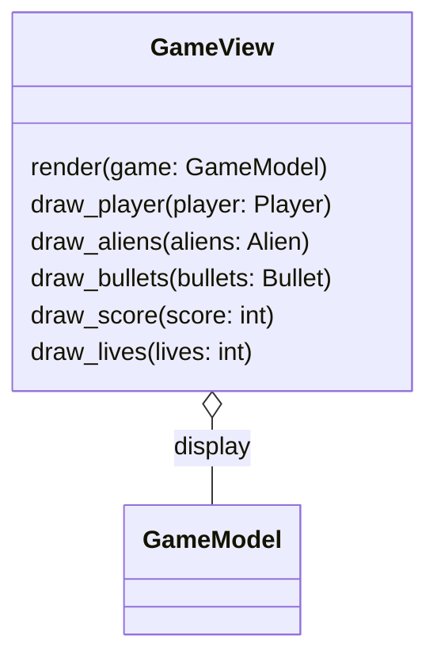

```mermaid
classDiagram
    class GameView {
        render(game: GameModel)
        draw_player(player: Player)
        draw_aliens(aliens: Alien)
        draw_bullets(bullets: Bullet)
        draw_score(score: int)
        draw_lives(lives: int)
    }

    GameView o-- GameModel : display
```